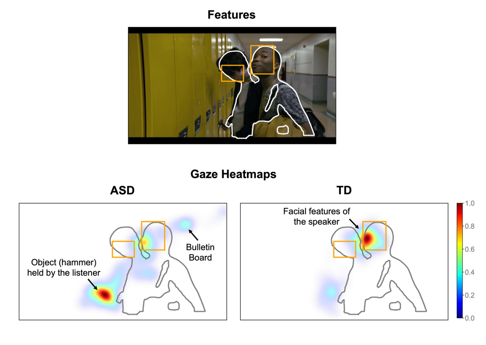

Our Caltech team, led by Dr. Na Yeon Kim, partnered with Google Resesarch, and conducted a proof-of-concept study that investigated social attention in autism using a smartphone eye-tracking technology.

We showed participants natural scene images and short YouTube videos, while measuring their eye movements from a screen-based eye-tracker and a smartphone eye-tracker. 

We found consistent results measured between the screen-based and smartphone eye-trackers. Autistic participants are more likely to focus on nonsocial aspects of the video, such as objects or background patterns, while neurotypical subjects focus more on social aspects, such as people's faces.

## Publication

Now published at _Autism Research_ titled **"Smartphone-based gaze estimation for in-home autism research"**.[Full text](https://onlinelibrary.wiley.com/doi/full/10.1002/aur.3140)

**Abstract**

>Atypical gaze patterns are a promising biomarker of autism spectrum disorder. To measure gaze accurately, however, it typically requires highly controlled studies in the laboratory using specialized equipment that is often expensive, thereby limiting the scalability of these approaches. Here we test whether a recently developed smartphone-based gaze estimation method could overcome such limitations and take advantage of the ubiquity of smartphones. As a proof-of-principle, we measured gaze while a small sample of well-assessed autistic participants and controls watched videos on a smartphone, both in the laboratory (with lab personnel) and in remote home settings (alone). We demonstrate that gaze data can be efficiently collected, in-home and longitudinally by participants themselves, with sufficiently high accuracy (gaze estimation error below 1° visual angle on average) for quantitative, feature-based analysis. Using this approach, we show that autistic individuals have reduced gaze time on human faces and longer gaze time on non-social features in the background, thereby reproducing established findings in autism using just smartphones and no additional hardware. Our approach provides a foundation for scaling future research with larger and more representative participant groups at vastly reduced cost, also enabling better inclusion of underserved communities.

## On Media

Our study also received attention from _The TCCI Research News_: [Autism Research Via Smartphone](https://www.cheninstitute.org/news/autism-research-via-smartphone)
