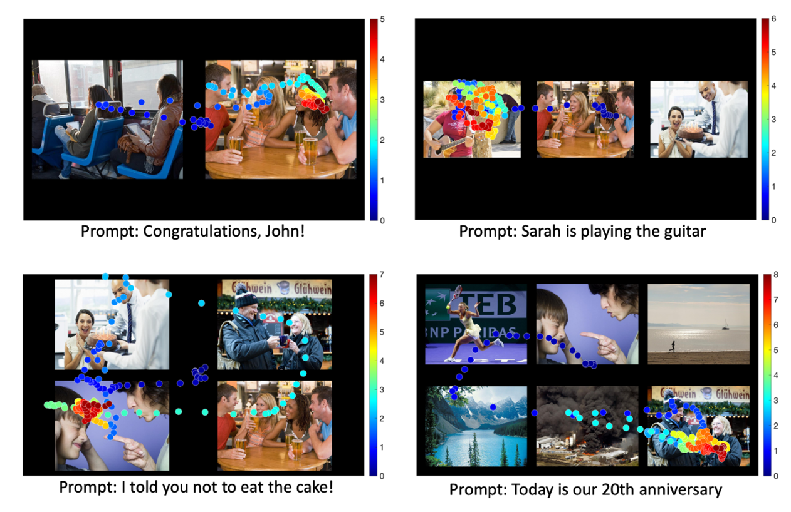
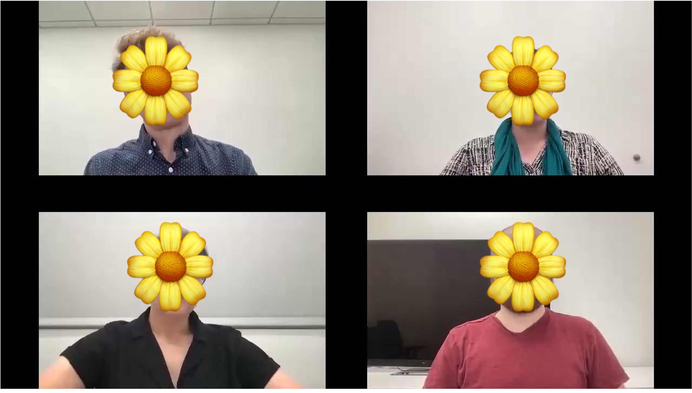
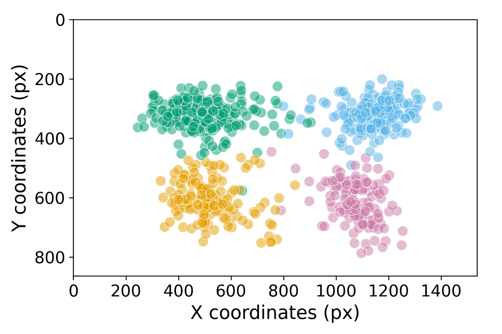
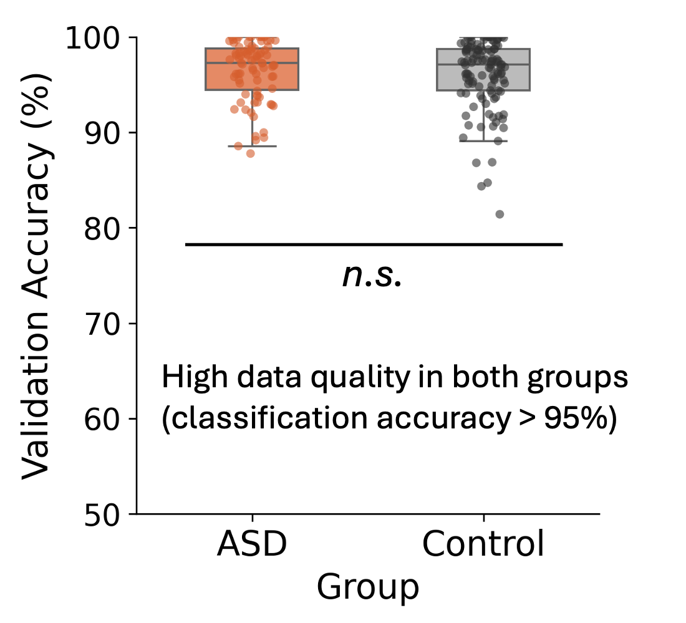
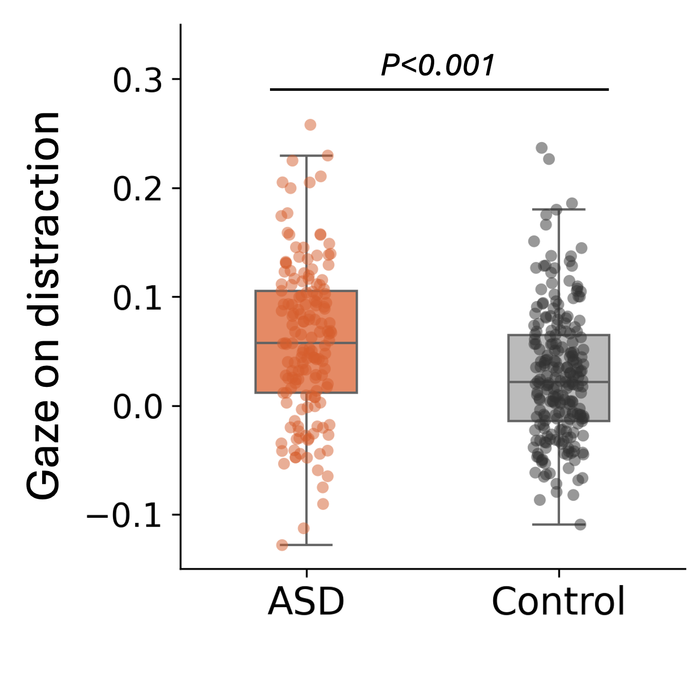

**TL;DR**

>We used webcam-based eye-tracking to study social attention in a large autistic sample. Participants watched Zoom-style group conversations while their gaze was recorded. Preliminary data from 97 autistic and 140 non-autistic adults suggest that autistic individuals may be more distracted by irrelevant nonsocial events.
A pre-registered replication with a broader sample is underway. Stay tuned!

### Webcam-based Eye-tracking
Traditional eye-tracking requires costly lab setups and in-person visits. We (co-lead with [Na Yeon Kim](https://nayeonckim.github.io/)) addressed this by using [WebGazer](https://webgazer.cs.brown.edu/), a webcam-based tool compatible with most home computers.
To work around its lower resolution, we designed a 2×2 grid-style stimulus layout.

### Feature-engineered Social Conversation Videos
We created scripted Zoom-style videos on various topics (e.g., group project, family chat, workplace conflict) using professional actors. Each video included social cues (e.g., turn-taking, listener reactions) and irrelevant background distractions, presented with orthogonal timing.

We collected eye-tracking data that can tell apart which quadrant the participant looks at.

### Large-scale Assessments on Autistic Adults
We recruited autistic and non-autistic adults via:
1. Prolific (online platform)
2. [SPARK (Simons Foundation database)](https://sparkforautism.org/portal/homepage/)
3. Local outreach in LA

Each participant watched multiple videos at home while using their own computer webcam to record their eye movements.

With some preliminary data from 97 autistic and 140 non-autistic participants, we found that 
- Overall, the data quality was good and comparable between the groups.
- Autistic individuals may be more prone to distraction by irrelevant nonsocial events in our video stimuli. 

### Conference Presentation
In May 2024, I presented these results at the International Society for Autism Research (INSAR) 2024 Annual Meeting in an oral session titled **_"Differential Gaze Patterns in Autism While Watching Video Conversations: An Online Eye-Tracking Study"_**. 

[Abstract](https://cdn.ymaws.com/www.autism-insar.org/resource/resmgr/docs/annualmeeting/abstract_book_2024.pdf)

### Ongoing Pre-registered Study
Our team is currently working on a pre-registered experiment using the same paradigm with a more diverse sample. Stay tuned! 

[see our OSF Preregistration](https://osf.io/xa5kd/) 
