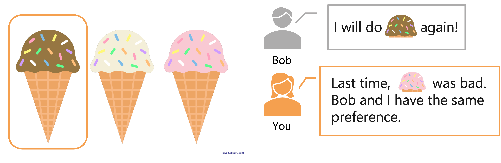
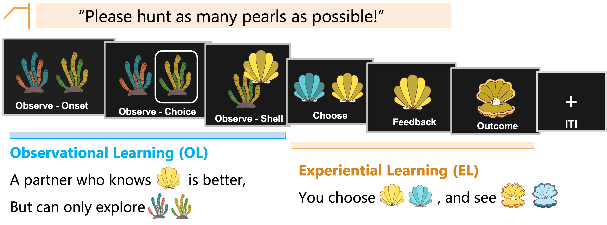
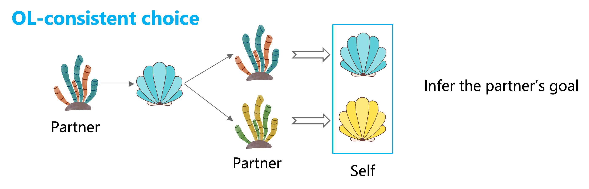
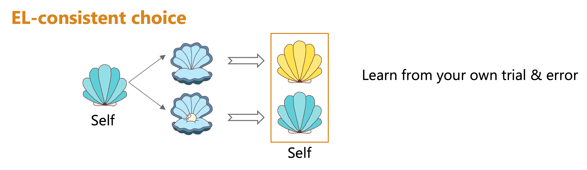
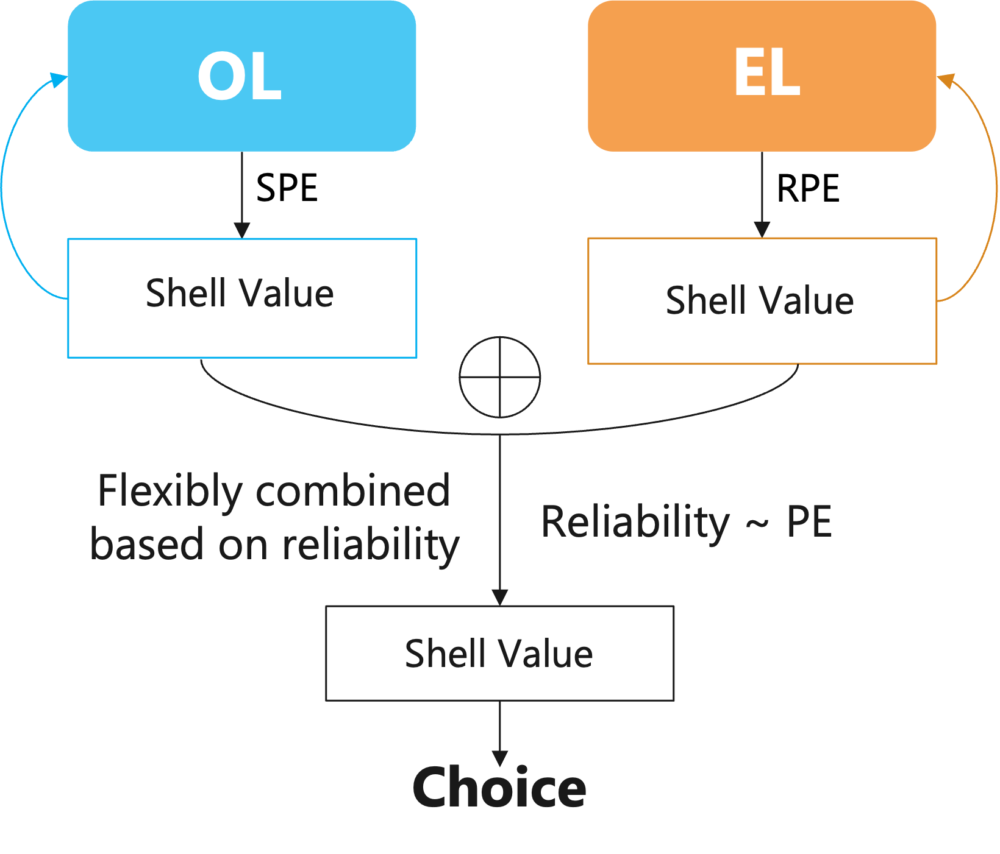
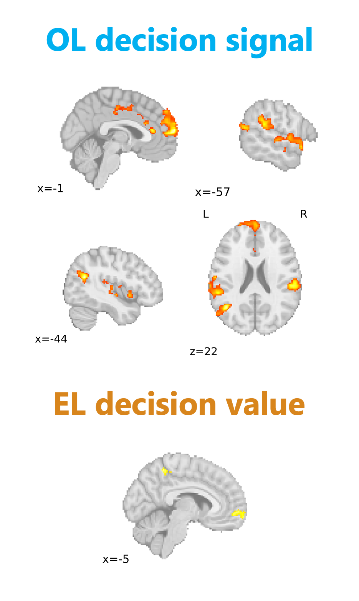
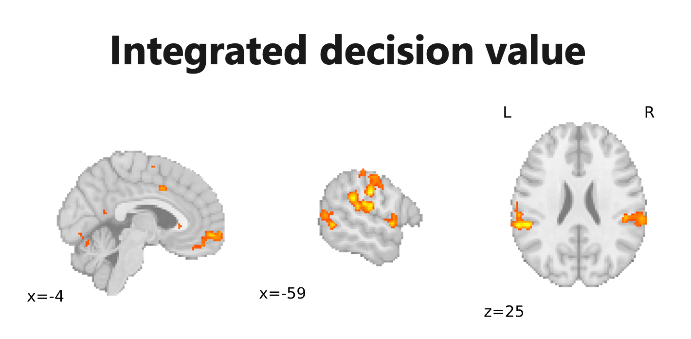

### An Ice Cream Decision

Imagine you are in an ice cream shop with your friend Bob, and there are 3 options: chocolate, vanilla, and strawberry.

- Bob has tried the chocolate one, and he decide to get it again. 
- Last time you did the strawberry one but you didn’t like it
- You think that Bob and you would have the same preference.

Therefore, you decided to buy the chocolate one. 

Similar situations happens everyday. Often, we make decisions by combining self experience and information from others. In this study, I asked **what is the neuro-computations of the information integration between observational and experiential domains**.

### A Social Pearl Hunting Task
To answer the question, I designed this social pearl hunting task, adapted from a [previous task](https://www.nature.com/articles/s41467-024-48548-y) by my mentor Caroline Charpentier.

In the task, participants rely on 2 sources of information in order to hunt pearls from shells:
1. Observation: a partner explore one of two corals, followed by a shell harvested from the chosen coral. The partner knows which shell is better, but they can only explore corals.
2. Experience: participant choose between two shells, and receive feedback as to whether a pearl (the reward) was inside the chosen shell.

### Disentangling Observational and Experiential Learning

In an OL-consistent choice, one infers the preference of the partner by observing two consecutive trials - whether the partner repeat the coral choice (they want the current shell), or switch the coral choice (they want the other shell).

 
In an EL-consistent choice, one repeat the past choice if that choice yielded a pearl, and switch otherwise.

### Reliability-based Arbitration

 
We propose a reliability-based arbitration model to explain the decisions: 
- there exists two systems that compute the shell values, and they update the values trial by trial through prediction errors.
- OL uses state prediction errors. SPE is high if the predicted shell from the partner’s chosen coral is different from the actual one. 
- EL uses reward prediction error. RPE is high if the predicted pearl outcome is different from the actual outcome.
 - Values computed from the two systems are flexibly combined based on the reliability - a function of the prediction errors. 

### Neural Mechanisms Underlying Value Computations

We tested where in the brain computes each type of decision value. 
 
We found the OL-based decision signal in the dorsal medial prefrontal cortex (dmPFC), temporal-parietal junction (TPJ), and superior temporal gyrus (STG). EL-based decision value in the ventromedial prefrontal cortex (vmPFC).

We also saw the integrated decision value in both vmPFC and STG.

### Conference Presentation
On Apr 2024, I presented the above results at the Social Affective Neuroscience Society (SANS) annual meeting as a data blitz talk titled _Neuro-computational Mechanism Of Reliability-based Arbitration Between Observational And Experiential Learning_. 

For more details, please check my poster below.

📥 **[Download PDF](uploads/OLEL_poster.pdf)**
<iframe src="/uploads/OLEL_poster.pdf#toolbar=0&navpanes=0&scrollbar=0" width="100%" height="600px"></iframe>

