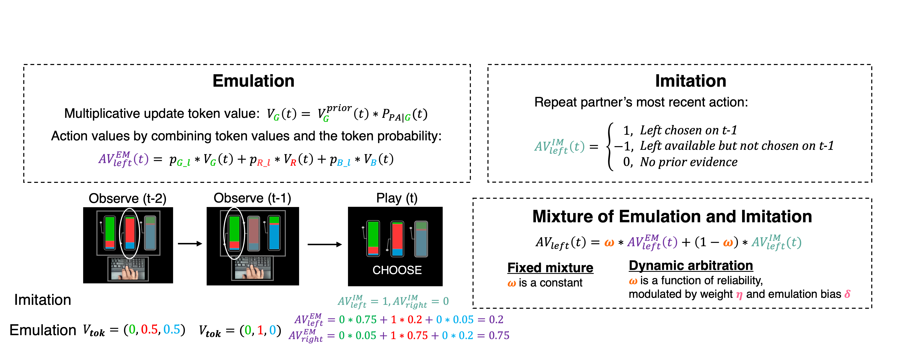
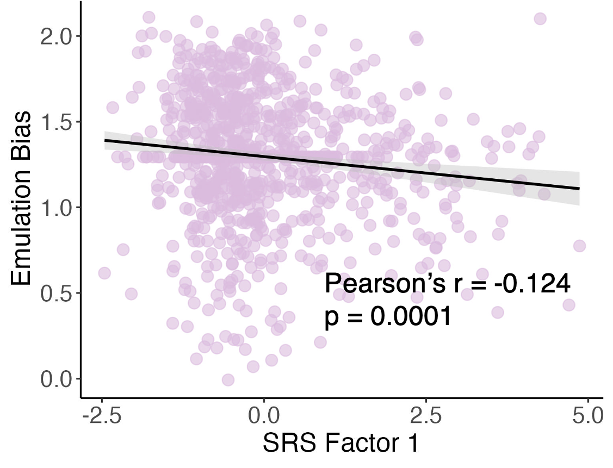

## Observational Learning

We learn about the world by observing others and inferring from social cues. Two strategies are typically involved during observational learning:
1. Goal emulation: the observer actively infers the observee’s beliefs and the environment, and selects actions most appropriate for the inferred goal
2. Action imitation: the observer repeats the observed actions without inferring the underlying goal

In this study, we administered an observational learning task to over 1,000 online participants. This task was designed to effectively dissociate goal emulation and action imitation.

—followed by a video showing the partner’s action (button press) and the chosen slot machine (bent arm). In ‘play’ trials, participants saw their own choice options and made a response, followed by choice feedback (bent arm) and token feedback. The proportion of colors on each slot machine corresponds to the probability of generating each colored token from that slot machine.")

## Computational Models of Observational Learning

To quantitatively describe people's behaviors, we developed a set of models to characterize their strategies, including:
1. Imitation model: one will repeat the partner's most recent action (left or right slot machine)
2. Emulation model: the value of the slot machines will be learned through Bayesian inferences, based on the observed choice history of the partner
3. Fixed mixture model: combine  imitation and emulation with a fixed probability
4. Dyanamic arbitration model: combine imitation and emulation with a changing probability, depending on the reliability of each strategy
5. Non-learning model: inattentive or task-irrelevant behaviors

## Individual differences in autistic traits

Human social behavior features profound individual differences. Some people are outgoing, others reclusive. Autism has emerged as a dimensional construct that underlines difficulties in social interaction and communication. 

Based on existing evidence about social learning challenges in autistic individuals, and nonautistic individuals who have high autistic traits, our hypothesis was that **individuals with higher levels of autism-like traits would be less likely to rely on emulation**.

A couple of results supported our hypothesis, here are two of them.

First, we clustered participants by their most likely strategies in the observational learning task. We defined 4 strategy groups based on the computational model fittings: a non-learning group, an imitation group, an emulation group, and a mixture group. We found that people in the emulation group had the lowest autistic scores, followed by the mixture group and imitation group. People in the non-learning group had the highest autistic scores.

")

Second, we looked at one parameter in the dynamic arbitration model - the emulation bias. This parameter represents one's inherent propensity of performing emulation over imitation, independent of the reliabilities of each strategy. We found that higher autistic traits were associated with reduced emulation bias.

## Publication

Now published at _Nature Mental Health_ titled [Individual differences in autism-like traits are associated with reduced goal emulation in a computational model of observational learning](https://www.nature.com/articles/s44220-024-00287-1).

## On Media

Please also check the post about this work on _PsyPost_ [Autistic traits linked to specific pattern of social learning, study finds](https://www.psypost.org/autistic-traits-linked-to-specific-pattern-of-social-learning-study-finds/).

